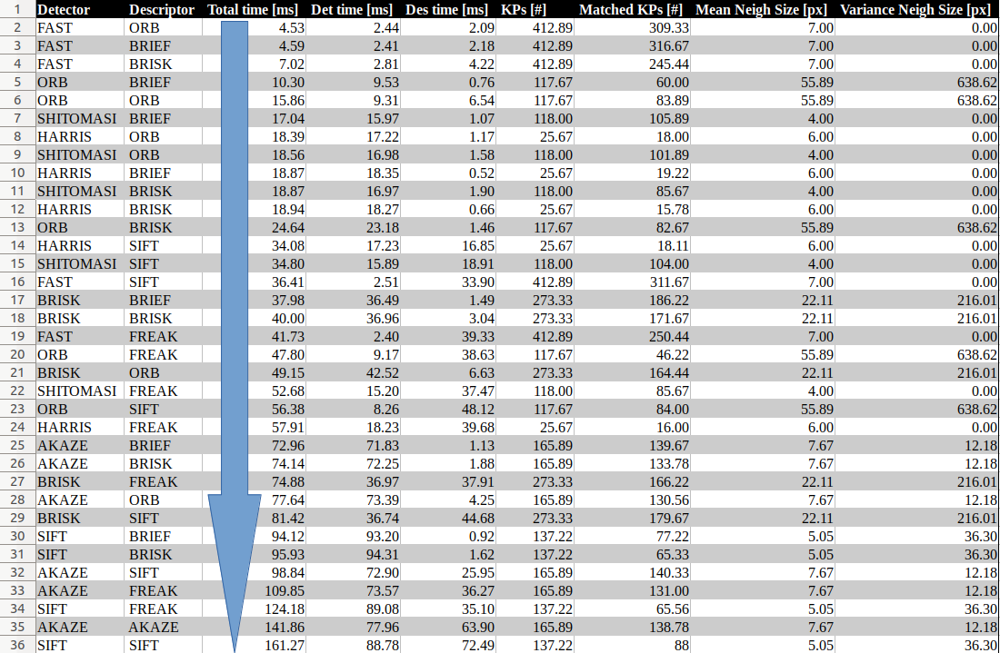

- [SFND 2D Feature Tracking](#sfnd-2d-feature-tracking)
  - [Dependencies for Running Locally](#dependencies-for-running-locally)
  - [Basic Build Instructions](#basic-build-instructions)
- [Mid-term Report](#mid-term-report)
  - [MP.1](#mp1)
  - [MP.2](#mp2)
  - [MP.3](#mp3)
  - [MP.4](#mp4)
  - [MP.5](#mp5)
  - [MP.6](#mp6)
  - [MP.7, 8 and 9](#mp7-8-and-9)


# SFND 2D Feature Tracking


The idea of the camera course is to build a collision detection system - that's the overall goal for the Final Project. As a preparation for this, you will now build the feature tracking part and test various detector / descriptor combinations to see which ones perform best. This mid-term project consists of four parts:

* First, you will focus on loading images, setting up data structures and putting everything into a ring buffer to optimize memory load. 
* Then, you will integrate several keypoint detectors such as HARRIS, FAST, BRISK and SIFT and compare them with regard to number of keypoints and speed. 
* In the next part, you will then focus on descriptor extraction and matching using brute force and also the FLANN approach we discussed in the previous lesson. 
* In the last part, once the code framework is complete, you will test the various algorithms in different combinations and compare them with regard to some performance measures. 

See the classroom instruction and code comments for more details on each of these parts. Once you are finished with this project, the keypoint matching part will be set up and you can proceed to the next lesson, where the focus is on integrating Lidar points and on object detection using deep-learning. 

## Dependencies for Running Locally
* cmake >= 2.8
  * All OSes: [click here for installation instructions](https://cmake.org/install/)
* make >= 4.1 (Linux, Mac), 3.81 (Windows)
  * Linux: make is installed by default on most Linux distros
  * Mac: [install Xcode command line tools to get make](https://developer.apple.com/xcode/features/)
  * Windows: [Click here for installation instructions](http://gnuwin32.sourceforge.net/packages/make.htm)
* OpenCV >= 4.1
  * This must be compiled from source using the `-D OPENCV_ENABLE_NONFREE=ON` cmake flag for testing the SIFT and SURF detectors.
  * The OpenCV 4.1.0 source code can be found [here](https://github.com/opencv/opencv/tree/4.1.0)
  * Steps:
  ```shell
  cd ~/opt
  git clone https://github.com/opencv/opencv.git
  git clone https://github.com/opencv/opencv_contrib.git
  cd opencv_contrib
  git checkout 4.1.0
  cd ../opencv
  git checkout 4.1.0 
  mkdir build
  cd build
  cmake -DOPENCV_EXTRA_MODULES_PATH=../../opencv_contrib/modules ..
  make -j4
  sudo make install
  ```

* gcc/g++ >= 5.4
  * Linux: gcc / g++ is installed by default on most Linux distros
  * Mac: same deal as make - [install Xcode command line tools](https://developer.apple.com/xcode/features/)
  * Windows: recommend using [MinGW](http://www.mingw.org/)

## Basic Build Instructions

1. Clone this repo.
2. Make a build directory in the top level directory: `mkdir build && cd build`
3. Compile: `cmake .. && make`
4. Run it: `./2D_feature_tracking`.

# Mid-term Report 

## MP.1
A naive data buffer was implemented using std::vector, as specified. A better choice would have been to use std::deque.

## MP.2
Implemented detectors HARRIS, FAST, BRISK, ORB, AKAZE, and SIFT. A string variable is used to select the desired detector.

## MP.3
Used the hard-coded Rectangle object provided to filter out keypoints not belonging to the "proximity" of the preceding vehicle.

## MP.4
Similarly to MP.2, implemented the descriptors BRIEF, ORB, FREAK, AKAZE and SIFT, corresponding string variable is used for selection.

## MP.5
Implemented FLANN + k-nearest neighbor selection. Selection possible through yet another string variable.

## MP.6
Implemented K-Nearest-Neighbor matching to implement the descriptor distance ratio tesT.

## MP.7, 8 and 9
In MP.7, 8 and 9 of the assignment a choice has to be made with respect to the best combination of detector and descriptor. To make this decision process easier, I created a version of the "main" program that runs all combinations in two nested for loops and prints each iteration to a CSV file, which I later ordered by total time. File can be found [here](src/MidTermProject_Camera_MP9_allCombinations.cpp).

It is worth mentioning that we do not have a ground truth set that we can use to validate our results, therefore we focus on the speed of the algorithms and on the number of matched keypoints.

The combination of __FAST detector and ORB descriptor__ yield the fastest performance and at the same it gives top results based on matched keypoints.

Find the complete table below, the raw original table [here](logs/summary.csv) and a folder with statistics specific to the performance of each combination on the set of image-pairs [here](logs/detector_descriptor_stats)




